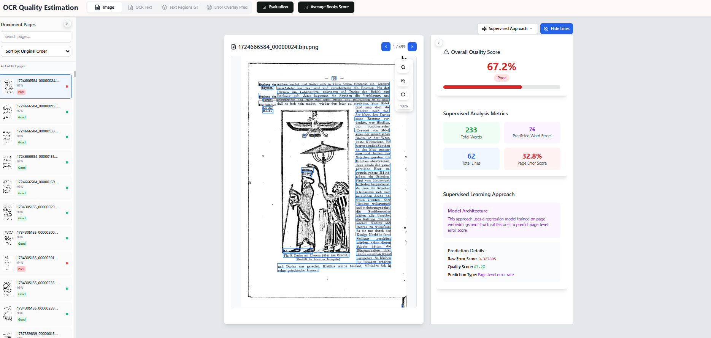

# OCR LLMs

This project focuses on OCR evaluation using multiple approaches, including Large Language Models (LLMs) and traditional NLP techniques.
The goal is to automatically detect and score OCR errors after OCR has been performed, across both supervised and unsupervised evaluation methods.

---

## Project Overview

* **Approaches**:
  We implement and compare various OCR quality estimation approaches:

  * **Supervised** 
  * **Unsupervised Chunks-based** 
  * **Unsupervised Likelihood-based** 

  
* **Jupyter Notebooks**:
  All methods are also demonstrated in the `notebooks/` directory for exploration and testing.
        
  * Each approach has its own folder with a dedicated `README.md` explaining how to run it.
  
* **Interactive GUI**:
  A Flask-based OCR Quality Estimation web app allows you to visualize predictions, view OCR text, and compare results interactively and it also has its own `README.md`.

---

## 📁 Project Structure

```
notebooks/      # Jupyter notebooks for all approaches (each contains its own README)
ocr_gui/        # OCR Quality Estimation web app (contains its own README)
src/            # Core modules, scoring methods, and evaluation functions
data/           # Example datasets (images, PAGE-XML, and related resources)

```

## Project setup

Install `uv` on your system:
- For Linux run from your terminal:

    `curl -LsSf https://astral.sh/uv/install.sh | sh`

- For Windows run from your terminal:

    `powershell -ExecutionPolicy ByPass -c "irm https://astral.sh/uv/install.ps1 | iex"`

- Or, install using pip:

    `pip install uv`

Verify that uv is correctly installed by running `uv --version`.

- Linux
```shell
    uv sync
    source .venv/bin/activate
```
- Windows
```shell
    uv sync
    source .venv\Scripts\activate
```
Dependencies and libraries can be installed simply by running:

```shell
    uv add DEP_NAME
```
*(list of all dependencies -> `pyproject.toml`, equivalent to `requirements.txt`)* If needed requirements can be always generated, based on the current dependencies configuration:

```shell
    uv export --no-hashes --no-emit-workspace > requirements.txt
```

For more information about `uv` check the documentation here **[uv-docs](https://docs.astral.sh/uv/)**.
---

## GUI 

* **Method Selector**: Choose between enabled methods
* **Sidebar**: Navigate through document pages
* **Main View**: Display page image, OCR text, or overlays
* **Right Panel**: See statistics 
* **Left Panel**: Search and sort based on the predicted scores

* **Evaluation**: Opens the dataset visualization interface.
Compares predicted error rates to ground truth and automatic evaluations.
Shows side-by-side plots and correlation metrics so you can see how closely each method matches the real annotated data.

* **Average Score Books**: Opens the book level statistics view. Displays per-book mean score, median score, and number of pages.

    Outputs:

    * `book_summaries.csv` → per-book average, median
    * `pagescores.csv` → all page scores


##  GUI Screenshots  

### Main Interface  
  

### Evaluation  
  

### Book Scores View  
  


---

## Supervised Script Usage

To run the **supervised** pipeline manually and generate:

* `pagescores.csv` (per-page scores)
* `book_summaries.csv` (aggregated per-book stats)

Go to the GUI folder and run:

```bash
cd ocr_gui
python supervised_runner.py
```


1. Train or load the supervised regression model.
2. Score all pages in the configured dataset.
3. Save the results to the book scores folder.

---


